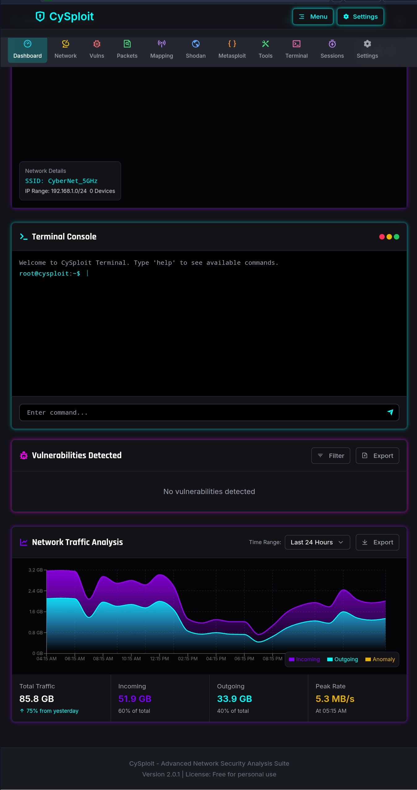
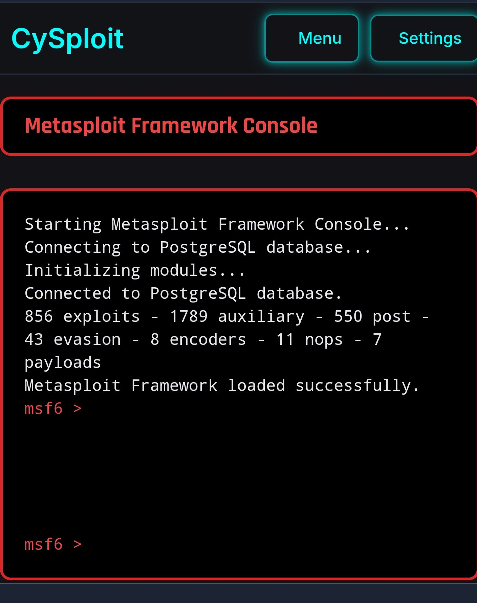
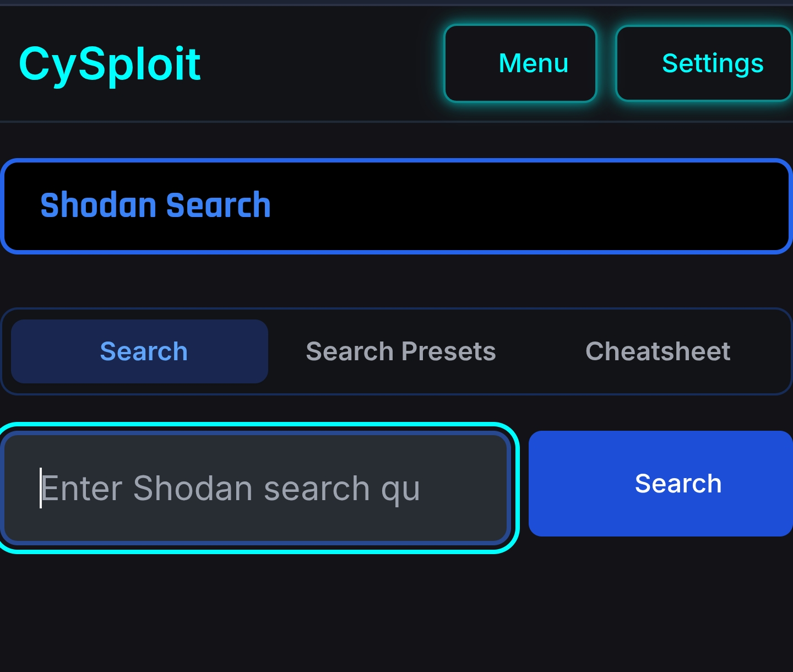
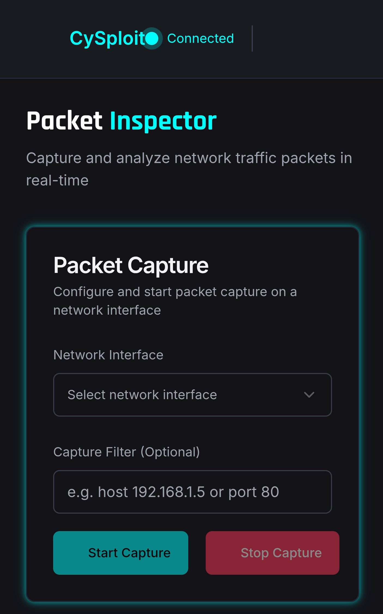

# CySploit

A cutting-edge cybersecurity web and desktop application that transforms network security assessment into an immersive, interactive experience with advanced scanning and cross-platform capabilities.





## Features

- **Web and Desktop Interface**: Use in browser or as a standalone application
- **Shodan Integration**: Powerful search capabilities for internet-connected devices
- **Network Discovery**: Scan and map your network
- **Vulnerability Scanner**: Identify potential security weaknesses
- **Packet Inspector**: Analyze network traffic
- **Metasploit Integration**: Connect to Metasploit for advanced penetration testing
- **3D Visualization**: View network data in an immersive 3D environment
- **Reporting**: Generate comprehensive security reports



## Technologies

- React.js frontend with TypeScript
- Express.js backend
- PostgreSQL database with Drizzle ORM
- Electron for cross-platform desktop support
- Shodan API integration
- Tailwind CSS for styling
- 3D visualization with A-Frame and Three.js



## Getting Started

### Prerequisites

- Node.js (v18+)
- PostgreSQL database
- Shodan API key (for Shodan features)

### Installation

1. Clone this repository
2. Install dependencies:
   ```
   npm install
   ```
3. Create a `.env` file based on `.env.example` and add your Shodan API key
4. Start the development server:
   ```
   npm run dev
   ```

### Building Desktop App

```
npm run electron:build
```

## Security Notice

This tool is intended for legitimate security research and network administration. Always ensure you have permission to scan networks and systems before using CySploit.

## License

MIT

## Contributing

See [CONTRIBUTING.md](./CONTRIBUTING.md) for guidelines on how to contribute to this project.
