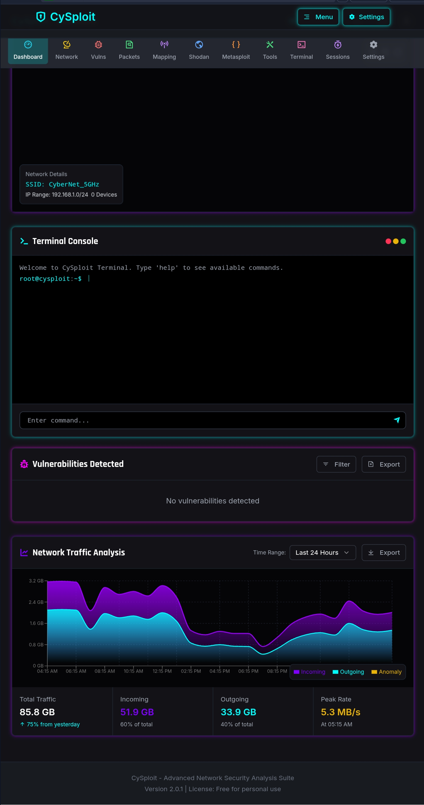

# CySploit

<!-- markdownlint-disable MD033 -->
  <h1>CySploit - Cybersecurity Analysis Platform</h1>
</div>
<div align="center">
  
</div>

*"A cutting-edge cybersecurity platform designed to simplify network security assessment through advanced, interactive scanning and analysis tools."* - Anonymous User

## Features

- **Network Discovery**: Scan and map your network to identify all connected devices
- **Vulnerability Scanning**: Detect vulnerabilities in network devices
- **Packet Analysis**: Capture and analyze network traffic
- **3D Visualization**: Visualize security data in interactive 3D maps
- **Shodan Integration**: Enhance reconnaissance with Shodan API data
- **Metasploit Integration**: Connect directly to Metasploit for penetration testing

## Technology Stack

- React.js with TypeScript for the frontend
- Express.js backend
- PostgreSQL database with Drizzle ORM
- Electron for cross-platform desktop support
- Shodan API integration
- Custom nmap services database support
- Metasploit Framework integration

## Installation

### Prerequisites

- Node.js (v18+ recommended)
- Docker + Docker Compose (for PostgreSQL)
- System tools used by scanning features: `nmap`, `ip` (usually from `iproute2`), `ping` (usually from `iputils`)

### Running from Source

1. Clone the repository:

   ```bash
   git clone https://github.com/yourusername/cysploit.git
   cd cysploit
   ```

2. Set up environment variables:

   ```bash
   cp .env.example .env
   # Edit .env and configure DATABASE_URL
   ```

3. Install dependencies:

   ```bash
   npm install
   ```

4. Start the PostgreSQL database:

   ```bash
   docker compose up -d
   ```

5. Apply database migrations:

   ```bash
   npm run db:migrate
   ```

6. Run the development server:

   ```bash
   npm run dev
   ```

7. Open your browser to `http://localhost:5000`

> Note: In dev, the backend serves both the API and the web UI on port `5000`.
> If you run the client separately (`npm run client`), it runs on `5173` and proxies `/api/*` to `http://localhost:5000`.

### Running as Desktop Application (Development)

To run the application as an Electron desktop app in development mode:

1. Make sure all dependencies are installed:

   ```bash
   npm install
   ```

2. Run the development server and Electron app simultaneously:

   ```bash
   npm run electron:dev
   ```

### Building as Desktop Application

You can build CySploit as a standalone desktop application for Linux, Windows, or Mac:

1. Make the build script executable:

   ```bash
   chmod +x build-electron.sh
   ```

2. Run the build script:

   ```bash
   ./build-electron.sh
   ```

3. The packaged application will be created in the `/dist` directory

#### Build AppImage (Linux)

To build only the Linux AppImage:

```bash
chmod +x build-appimage.sh
./build-appimage.sh
```

#### Platform-Specific Builds

- **Linux (AppImage, Deb, RPM)**:

  ```bash
  npx electron-builder build --linux --publish never
  ```

- **Windows (Installer, Portable)**:

  ```bash
  npx electron-builder build --win --publish never
  ```

- **macOS (DMG, ZIP)**:

  ```bash
  npx electron-builder build --mac --publish never
  ```

#### <b><u>***Quick Start Electron Desktop Application for CySploit***</u></b>

```bash
cd CySploit                  # Change into CySploit directory
docker compose up -d         # Start up the PostgreSQL database (including Metasploit DB init)
cp .env.example .env         # Create environment configuration file
npm i                        # Install dependencies
npm run build                # Build client & server
npm run check                # Run lint for errors
npm run db:migrate           # Migrate database entries into database
./build-electron.sh          # Compile the electron app
./run-cysploit.sh            # Execute the client and server connected to our database
```

## Configuration

### Shodan API

1. Obtain a Shodan API key from [https://shodan.io](https://shodan.io)
2. Enter the API key in the Settings → API Keys section of CySploit

### Metasploit Integration

1. Ensure Metasploit Framework is installed on your system
2. Configure the Metasploit connection settings in the Settings section
3. The shared PostgreSQL database will be used by both CySploit and Metasploit

## Usage

### Network Discovery

1. Navigate to the Network Discovery page
2. Enter the network range to scan (e.g., 192.168.1.0/24)
3. Click "Start Scan" to begin discovering devices

### Vulnerability Scanning

1. Select a device from the discovered list
2. Navigate to the Vulnerability Scanner page
3. Click "Scan Device" to detect vulnerabilities

### Data Visualization

1. After collecting data from scans, navigate to the Network Mapping page
2. The 3D visualization will display your network topology and security findings
3. Export reports for further analysis in other tools

## Contributing

We welcome contributions! Please see [CONTRIBUTING.md](CONTRIBUTING.md) for guidelines.

## Releases

For information about creating releases and the CI/CD pipeline, see [RELEASE.md](RELEASE.md).

To download the latest release, visit the [Releases page](https://github.com/webmaster-exit-1/CySploit/releases).

## License

Copyright © 2025 CySploit Team - All rights reserved

## Acknowledgments

- Icons created using SVG
- Visualization capabilities inspired by SandDance and Jok3r
- Network scanning components adapted from open-source security tools
